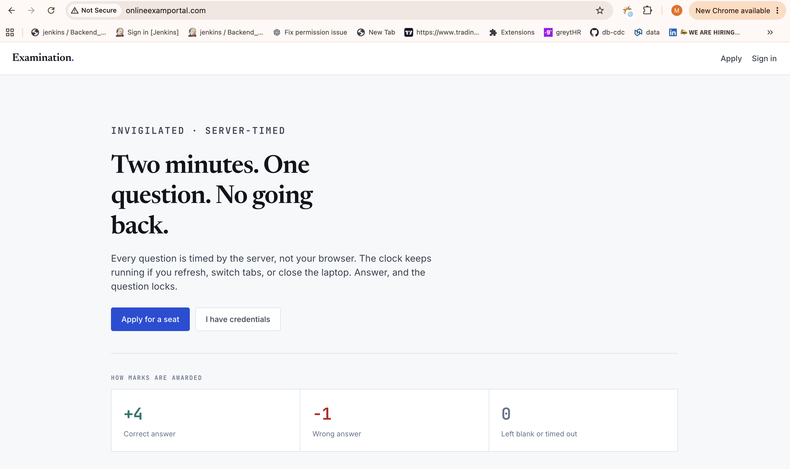
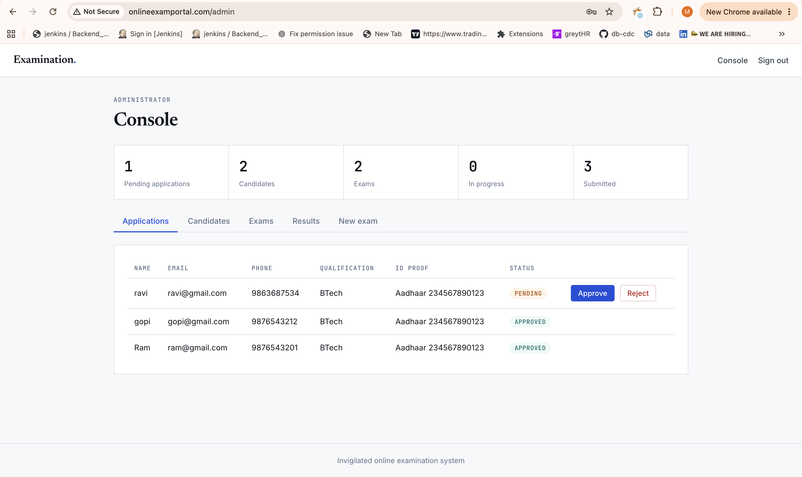
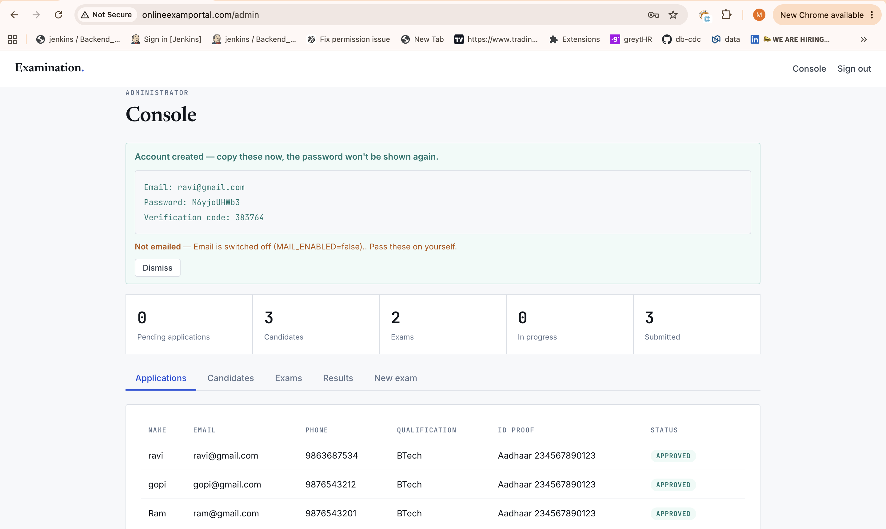
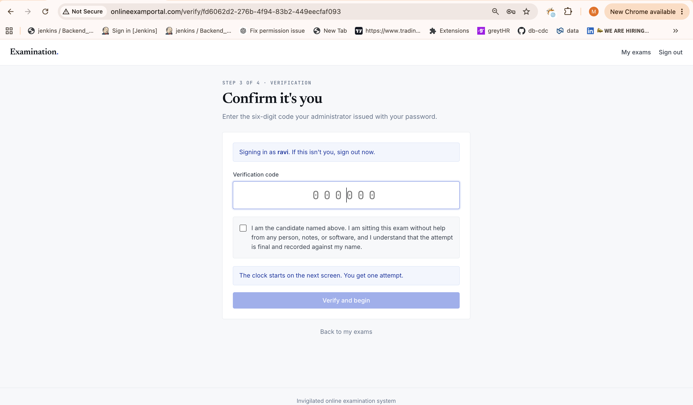
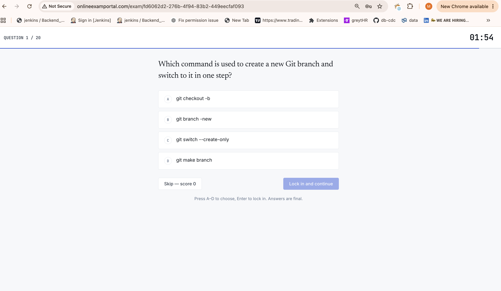

# Online Examination System Portal

A full-stack, invigilated online examination portal. Candidates apply, an administrator issues their credentials, and each exam runs as a **server-timed, one-question-at-a-time** MCQ engine — the clock lives on the server, so refreshing, switching tabs, or closing the laptop never buys extra time.

Built with FastAPI and React, containerised with Docker, and deployed to Kubernetes with Helm.

---

## Table of contents

- [Features](#features)
- [Tech stack](#tech-stack)
- [Screenshots](#screenshots)
- [Architecture](#architecture)
- [Getting started](#getting-started)
  - [Run locally with Docker Compose](#run-locally-with-docker-compose)
  - [Deploy on Kubernetes with Helm](#deploy-on-kubernetes-with-helm)
- [The candidate journey](#the-candidate-journey)
- [Marking scheme](#marking-scheme)
- [Administration](#administration)
- [Configuration](#configuration)
- [Project structure](#project-structure)

---

## Features

- **Application intake** — anyone can apply for a seat through a public form. Applying creates an *application*, not an account.
- **Admin-issued accounts** — the administrator reviews each application and, on approval, the system generates a password and a six-digit verification code. These are shown once and can be regenerated at any time.
- **Server-timed engine** — every question is timed by the backend. Two minutes per question by default; when the clock hits zero the question locks as unattempted.
- **One question per screen** — answers are final. There is no going back once a question is locked in.
- **Identity confirmation** — before an exam begins, the candidate enters their verification code and accepts a declaration that they are sitting the exam unaided.
- **Multiple exams** — ships with two ready-to-use papers, *Computer Science Fundamentals* (5 questions) and *DevOps Engineer* (20 questions), and admins can create more.
- **Results and leaderboard** — candidates see a per-question review of their attempt; administrators see a ranked leaderboard per exam.
- **Optional email delivery** — credentials can be emailed automatically over SMTP, or kept in the admin console to be passed on manually.

---

## Tech stack

| Layer | Technology |
|---|---|
| Backend | FastAPI, SQLAlchemy 2, Pydantic, JWT auth |
| Frontend | React 18, Vite, React Router |
| Database | MySQL 8 |
| Packaging | Docker, Docker Compose |
| Orchestration | Kubernetes, Helm |

---

## Screenshots

**Landing page** — the candidate-facing entry point.



**Administrator console** — review applications, approve or reject, and track live exam activity at a glance.



**Credential generation** — on approval, a password and six-digit verification code are generated and shown once.



**Candidate dashboard** — assigned exams, each with its question count, per-question time, and marking scheme.



**Live exam** — one question per screen with a server-driven countdown.



---

## Architecture

Three services run independently and communicate over HTTP:

```
┌─────────────┐      ┌─────────────┐      ┌─────────────┐
│   Frontend  │─────▶│   Backend   │─────▶│    MySQL    │
│ React + Vite│ HTTP │   FastAPI   │  SQL │             │
│  (nginx)    │◀─────│             │◀─────│             │
└─────────────┘      └─────────────┘      └─────────────┘
```

The frontend is served as static files through nginx. The backend exposes a REST API (interactive docs at `/docs`). State — applications, users, exams, questions, attempts, and answers — lives in MySQL.

---

## Getting started

### Run locally with Docker Compose

You need Docker Desktop (or Docker Engine + Compose). Nothing else.

```bash
cd exam-app-code/exam-app
docker compose up --build
```

The first build takes a few minutes. Once it settles:

| Service | URL |
|---|---|
| Portal | http://localhost:8080 |
| API docs (Swagger) | http://localhost:8000/docs |

**Default admin sign-in:** `admin@exam.com` / `Admin@12345`

To stop, press `Ctrl+C`. To wipe the database and start clean:

```bash
docker compose down -v
```

### Deploy on Kubernetes with Helm

The `helm-chart/` directory contains three charts — `db`, `backend`, and `frontend` — that deploy the full stack to a Kubernetes cluster (tested on Minikube).

```bash
# from the repository root
helm install db       ./helm-chart/db
helm install backend  ./helm-chart/backend
helm install frontend ./helm-chart/frontend
```

Confirm everything is running:

```bash
kubectl get pods
```

The backend seeds its exams on first startup against an empty database.

---

## The candidate journey

1. **Apply** — a prospective candidate fills in the public form. This records an application with a *pending* status.
2. **Approve** — the administrator reviews the application and approves it. Only now is an account created, and the system returns a password and a six-digit verification code, shown once.
3. **Sign in** — the candidate signs in with the issued email and password.
4. **Instructions** — the rules and marking scheme are shown before anything begins.
5. **Verify** — the candidate enters the six-digit code and accepts the declaration.
6. **Exam** — one question per screen, two minutes each, four options, one correct. The server enforces the clock.
7. **Result** — a score with a question-by-question review. The administrator sees a ranked leaderboard.

---

## Marking scheme

| Outcome | Marks |
|---|---|
| Correct answer | **+4** |
| Wrong answer | **−1** |
| Blank or timed out | **0** |

All three values, along with the time allowed per question, are configurable per exam.

---

## Administration

The administrator console groups everything under one page:

- **Applications** — approve or reject incoming applications. Approval issues credentials.
- **Candidates** — reset a candidate's password, issue a fresh verification code, or disable an account.
- **Exams** — create new exams, add questions, activate or deactivate a paper, or remove one.
- **Results** — a ranked leaderboard for any exam.

Because credentials are regenerable, an administrator can always issue a candidate a new password or verification code if the originals are lost.

---

## Configuration

Copy the example environment file and fill in your values:

```bash
cp exam-app-code/exam-app/.env.example exam-app-code/exam-app/.env
```

Email delivery is optional. With `MAIL_ENABLED=false`, the application works normally and issued credentials simply stay in the admin console to be passed on manually. To send credentials automatically, set `MAIL_ENABLED=true` and provide SMTP settings — the example file includes ready-to-use templates for Gmail, Resend, and Brevo.

> `.env` is gitignored. Never commit real credentials.

---

## Project structure

```
.
├── exam-app-code/
│   └── exam-app/
│       ├── backend/            FastAPI application
│       │   └── app/
│       │       ├── routers/    auth, admin, and exam endpoints
│       │       ├── models.py   SQLAlchemy models
│       │       ├── seed.py     initial exams and admin account
│       │       └── main.py     application entry point
│       ├── frontend/           React + Vite single-page app
│       │   └── src/
│       │       ├── pages/      Apply, Login, Verify, Exam, Result, Admin …
│       │       └── components/ shared layout and route guards
│       ├── docker-compose.yml
│       └── .env.example
└── helm-chart/                 Kubernetes deployment
    ├── db/
    ├── backend/
    └── frontend/
```
